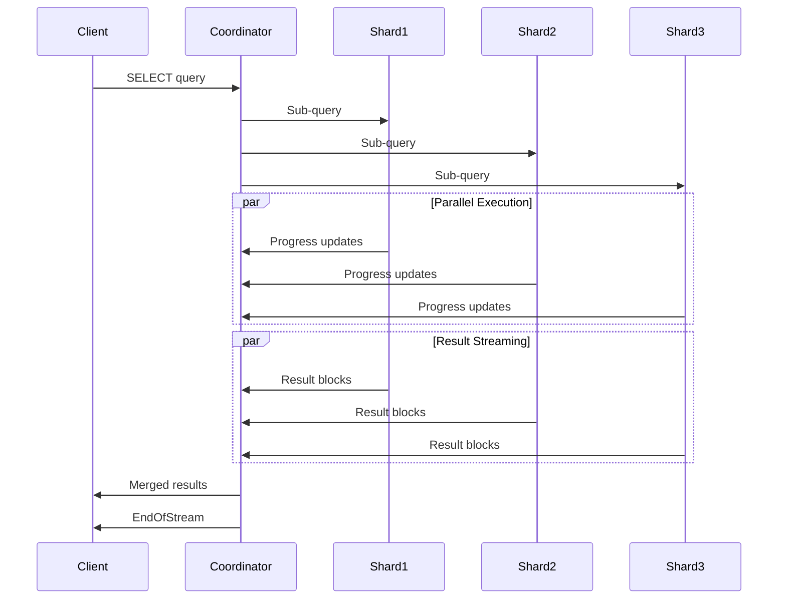

# ClickHouse Binary Protocol - Protocol State Management

This document provides detailed specifications for protocol state management, connection lifecycle, query execution flow, and transaction handling in the ClickHouse native binary protocol.

## Protocol State Overview

The ClickHouse protocol implements a **stateful connection model** with explicit state transitions, query lifecycle management, and distributed query coordination. The protocol supports:

- **Connection pooling** and reuse across queries
- **Multi-phase authentication** with various methods
- **Streaming query execution** with progress reporting
- **Query cancellation** and partial result handling
- **Distributed transaction** coordination (limited)
- **Error recovery** and connection cleanup

---

## 1. Connection Lifecycle

### 1.1 Connection States

The connection state machine is implemented in `TCPHandler` with the following states:

| State | Description | Transitions |
|-------|-------------|-------------|
| **DISCONNECTED** | Initial state, no TCP connection | → CONNECTING |
| **CONNECTING** | TCP connection establishment in progress | → HELLO_EXCHANGE |
| **HELLO_EXCHANGE** | Handshake and version negotiation | → AUTHENTICATED |
| **AUTHENTICATED** | Authentication completed successfully | → IDLE |
| **IDLE** | Ready to receive queries | → QUERY_PROCESSING |
| **QUERY_PROCESSING** | Actively processing a query | → DATA_TRANSFER, CANCELLED |
| **DATA_TRANSFER** | Sending/receiving data blocks | → IDLE |
| **ERROR_STATE** | Connection error, needs cleanup | → DISCONNECTED |
| **CANCELLED** | Query cancelled, cleanup in progress | → IDLE |

### 1.2 State Transition Diagram

```
[DISCONNECTED] 
       ↓ connect()
[CONNECTING]
       ↓ TCP established  
[HELLO_EXCHANGE]
       ↓ sendHello()/receiveHello()
[AUTHENTICATED]
       ↓ authentication success
[IDLE] ←-------------------┐
   ↓ receiveQuery()        │
[QUERY_PROCESSING] --------┤
   ↓ execution starts      │ 
[DATA_TRANSFER]            │
   ↓ query complete -------┘
```

### 1.3 QueryState Structure

Each active query maintains state through the `QueryState` structure:

```cpp
struct QueryState {
    // Identity and Context
    String query_id;                              // Unique query identifier (UUID)
    ContextMutablePtr query_context;              // Execution context
    QueryProcessingStage::Enum stage;             // Current processing stage
    
    // Protocol Settings
    Protocol::Compression compression;            // Compression mode
    UInt64 client_tcp_protocol_version;          // Client protocol version
    
    // State Flags  
    bool allow_partial_result_on_first_cancel;   // Return partial on cancel
    bool stop_read_return_partial_result;        // Stop and return partial
    bool stop_query;                             // Cancellation requested
    bool sent_all_data;                          // All output transmitted
    bool need_receive_data_for_insert;           // Expecting INSERT data
    bool read_all_data;                          // All input received
    bool skipping_data;                          // Error recovery mode
    
    // I/O Streams
    std::shared_ptr<ReadBuffer> maybe_compressed_in;
    std::unique_ptr<NativeReader> block_in;
    std::shared_ptr<WriteBuffer> maybe_compressed_out;
    std::unique_ptr<NativeWriter> block_out;
    
    // Progress and Timing
    Progress progress;                           // Query progress metrics
    Stopwatch watch;                            // Execution timer
    UInt64 prev_elapsed_ns;                     // Last progress timestamp
    
    // Timeout Management
    std::unique_ptr<TimeoutSetter> timeout_setter;
    
    // Profile Events
    ProfileEvents::Counters last_sent_snapshots; // Profile event snapshots
    ThreadGroupPtr thread_group;                  // Thread group for profiling
};
```

### 1.4 Connection Establishment Sequence

**Step 1: TCP Connection**
```cpp
// Client establishes TCP connection to server
socket.connect(server_address, port);  // Typically port 9000
```

**Step 2: Client Hello**
```cpp
writeVarUInt(Protocol::Client::Hello, out);
writeStringBinary("ClickHouse client", out);     // Client name
writeVarUInt(24, out);                           // Major version
writeVarUInt(10, out);                           // Minor version  
writeVarUInt(54477, out);                        // Protocol version
writeStringBinary("default", out);               // Database
writeStringBinary("default", out);               // User
writeStringBinary("", out);                      // Password
```

**Step 3: Server Hello Response**
```cpp
readVarUInt(packet_type);  // Expect Protocol::Server::Hello (0)
readStringBinary(server_name);      // "ClickHouse"
readVarUInt(server_version_major);  // 24
readVarUInt(server_version_minor);  // 10
readVarUInt(server_revision);       // 54477
readStringBinary(server_timezone);  // "UTC" (if supported)
```

**Step 4: Authentication Validation**
- Server validates credentials
- On success: Connection moves to AUTHENTICATED state
- On failure: Server sends Exception packet and closes connection

---

## 2. Query Execution Flow

### 2.1 Query Processing Phases

Query execution follows these phases in `TCPHandler::processQuery()`:

1. **Query Receipt**: Parse incoming Query packet
2. **Context Setup**: Create query context with settings
3. **Authentication Check**: Verify user permissions  
4. **Query Analysis**: Parse and validate SQL
5. **Pipeline Creation**: Build execution pipeline
6. **Data Exchange**: Handle INSERT data or stream results
7. **Completion**: Send EndOfStream and cleanup

### 2.2 SELECT Query Execution

**Packet Exchange Pattern:**
```
Client → Server: Query packet
Server → Client: Data packet (result header/schema)
Server → Client: Progress packets (periodic updates)
Server → Client: Data packets (result rows)
Server → Client: ProfileEvents packets (performance metrics)
Server → Client: EndOfStream packet
```

**Example SELECT Execution:**
```cpp
// Phase 1: Query Submission
Client sends: Query("SELECT count() FROM users")

// Phase 2: Result Schema  
Server sends: Data(header with column "count()" UInt64)

// Phase 3: Execution with Progress
Server sends: Progress(rows=0, bytes=0, total_rows=1000000)
Server sends: Progress(rows=500000, bytes=50MB, total_rows=1000000) 
Server sends: Progress(rows=1000000, bytes=100MB, total_rows=1000000)

// Phase 4: Results
Server sends: Data(1 row: [1000000])

// Phase 5: Completion
Server sends: EndOfStream()
```

### 2.3 INSERT Query Execution

**Packet Exchange Pattern:**
```
Client → Server: Query packet
Server → Client: Data packet (INSERT structure/schema)
Client → Server: Data packets (INSERT data blocks)
Client → Server: Empty Data packet (end marker)
Server → Client: EndOfStream packet
```

**Example INSERT Execution:**
```cpp
// Phase 1: INSERT Preparation
Client sends: Query("INSERT INTO users (id, name) VALUES")
Server sends: Data(header: id UInt32, name String)

// Phase 2: Data Transmission
Client sends: Data([{1, "Alice"}, {2, "Bob"}])
Client sends: Data([{3, "Carol"}, {4, "Dave"}])
Client sends: Data(empty block)  // End marker

// Phase 3: Completion  
Server sends: EndOfStream()
```

### 2.4 Query with External Tables

**External tables** provide additional data for query execution:

```cpp
// Query with external table data
Client sends: Query("SELECT * FROM temp_table")
Client sends: Data("temp_table", [{col1: "value1"}])  // External table data
Client sends: Data("")  // End external tables
Server sends: Data(results...)
Server sends: EndOfStream()
```

### 2.5 Progress Reporting Mechanism

Progress reporting is controlled by `sendProgress()` in TCPHandler:

```cpp
void TCPHandler::sendProgress() {
    Progress current_progress = getProgress();
    
    // Send progress if significant change or time elapsed
    if (progress_threshold_exceeded(current_progress)) {
        writeVarUInt(Protocol::Server::Progress, *out);
        current_progress.writeProgress(*out, client_tcp_protocol_version);
        out->next();
    }
}
```

**Progress Packet Structure:**
```
VarUInt packet_type = 3           // Progress packet
VarUInt rows_read                 // Rows processed
VarUInt bytes_read                // Bytes processed  
VarUInt total_rows_to_read        // Estimated total rows
VarUInt total_bytes_to_read       // Estimated total bytes (if supported)
VarUInt written_rows              // Rows written (for INSERTs)
VarUInt written_bytes             // Bytes written (for INSERTs)
```

### 2.6 ProfileEvents Streaming

**Real-time performance metrics** sent via ProfileEvents packets:

```cpp
// ProfileEvents packet structure
VarUInt packet_type = 14          // ProfileEvents packet
String external_table_name = ""   // Empty for main data
Block profile_events_block        // Native block with metrics

// Block contains columns:
// - host_name (String)
// - current_time (DateTime)  
// - thread_id (UInt64)
// - type (Int8): INCREMENT=1, GAUGE=2
// - name (String): metric name
// - value (Int64): metric value
```

**Example ProfileEvents:**
```
CompressedReadBufferBytes = 179030000000    // Compressed bytes read
SelectedBytes = 229470000000                // Bytes selected
OSReadBytes = 12080000000                   // OS-level bytes read
RowsReadByMainReader = 3130000000          // Rows read by main thread
```

---

## 3. Query Cancellation and Cleanup

### 3.1 Cancellation Methods

**Client-Initiated Cancellation:**
```cpp
Client sends: Cancel packet (0x03)
Server response: Stop query execution, return partial results or error
```

**Timeout-Based Cancellation:**
- **Connection timeout**: Idle connection cleanup
- **Query timeout**: Long-running query termination  
- **Network timeout**: Socket-level timeouts

### 3.2 Cancellation State Handling

```cpp
void TCPHandler::processCancel() {
    if (state.allow_partial_result_on_first_cancel && 
        !state.stop_read_return_partial_result) {
        // First cancel: return partial results
        state.stop_read_return_partial_result = true;
        LOG_INFO("Query cancelled by client, returning partial result");
    } else {
        // Second cancel or no partial results: full cancellation
        state.read_all_data = true;
        state.stop_query = true;
        throw Exception(ErrorCodes::QUERY_WAS_CANCELLED_BY_CLIENT, 
                       "Query was cancelled by client");
    }
}
```

### 3.3 Cleanup Procedures

**Query Cleanup:**
1. Stop query execution pipeline
2. Release resources (memory, file handles)
3. Reset QueryState to clean state
4. Send Exception or partial results
5. Return connection to IDLE state

**Connection Cleanup:**
1. Close input/output streams
2. Clear connection buffers
3. Reset protocol state
4. Close TCP socket
5. Remove from connection pool

---

## 4. Transaction Handling

### 4.1 Transaction Architecture

ClickHouse implements **lightweight transactions** primarily for consistency:

**Transaction Types:**
- **Implicit Transactions**: Single-statement operations (default)
- **Explicit Transactions**: BEGIN/COMMIT/ROLLBACK blocks (limited)
- **Part Transactions**: MergeTree data part operations
- **Distributed Coordination**: Cross-shard operation coordination

### 4.2 Transaction State Management

**TransactionID Structure:**
```cpp
struct TransactionID {
    UInt64 start_csn;    // Commit Sequence Number at transaction start
    UInt64 local_tid;    // Local transaction identifier  
    UUID host_id;        // Originating host UUID
    
    String toString() const;
    static TransactionID parse(const String & str);
    bool isValid() const { return start_csn != 0; }
};
```

**Transaction States:**
```cpp
enum TransactionState {
    RUNNING = 0,         // Transaction in progress
    COMMITTED = 1,       // Transaction committed successfully
    ROLLED_BACK = 2      // Transaction rolled back
};
```

### 4.3 Transaction Lifecycle

**Explicit Transaction Flow:**
```cpp
// Transaction start
Client sends: Query("BEGIN TRANSACTION")
Server response: EndOfStream

// Transaction operations  
Client sends: Query("INSERT INTO table VALUES ...")
Server response: Data packets, EndOfStream

// Transaction completion
Client sends: Query("COMMIT") 
Server response: EndOfStream (success) or Exception (failure)
```

**Rollback Handling:**
```cpp
// Automatic rollback on error
try {
    executeTransaction();
} catch (const Exception & e) {
    rollbackTransaction();
    throw;
}
```

### 4.4 Distributed Transaction Coordination

**Limited Distributed Support:**
- No full ACID transactions across shards
- Best-effort consistency for distributed operations
- Part-level transactions for MergeTree tables
- Eventual consistency for replicated tables

---

## 5. Connection Pooling and Management

### 5.1 Connection Pool Architecture

**ConnectionPool Class:**
```cpp
class ConnectionPool : public IConnectionPool {
public:
    // Pool configuration
    unsigned max_connections;
    String host, default_database, user, password;
    Protocol::Compression compression;
    Protocol::Secure secure;
    ConnectionTimeouts timeouts;
    
    Entry get(const ConnectionTimeouts & timeouts) override;
    
private:
    mutable std::mutex mutex;
    mutable Connections connections;  // Available connections
    mutable UInt64 connection_id_counter = 0;
    
    ConnectionPtr allocObject() override;
    void returnObject(ConnectionPtr connection) override;
};
```

### 5.2 Connection Reuse Strategy

**Connection Lifecycle in Pool:**
1. **Allocation**: Create new connection or reuse from pool
2. **Authentication**: Verify connection is still valid
3. **Query Execution**: Use connection for queries
4. **Return to Pool**: Clean state and return for reuse
5. **Cleanup**: Remove invalid or expired connections

**Health Check Mechanism:**
```cpp
bool Connection::ping() {
    try {
        writeVarUInt(Protocol::Client::Ping, *out);
        out->next();
        
        UInt64 packet_type = readVarUInt(*in);
        return packet_type == Protocol::Server::Pong;
    } catch (...) {
        return false;  // Connection failed
    }
}
```

### 5.3 Connection Pool Benefits

**Performance Optimizations:**
- **Reduced Connection Overhead**: Reuse authenticated connections
- **Better Resource Utilization**: Share connections across queries  
- **Automatic Health Management**: Remove failed connections
- **Load Distribution**: Balance connections across hosts

**Connection Pool Configuration:**
```cpp
ConnectionPoolPtr pool = std::make_shared<ConnectionPool>(
    max_connections,     // Maximum pool size
    host, port,         // Server address
    default_database,   // Default database
    user, password,     // Authentication
    compression,        // Compression settings
    secure,            // SSL/TLS settings
    timeouts           // Network timeouts
);
```

---

## 6. Error Handling and Recovery

### 6.1 Error Classification

**Connection-Level Errors:**
- `SOCKET_TIMEOUT`: Network communication timeout
- `NETWORK_ERROR`: TCP socket errors
- `AUTHENTICATION_FAILED`: Authentication failure
- `CLIENT_HAS_CONNECTED_TO_WRONG_PORT`: Protocol mismatch
- `UNEXPECTED_PACKET_FROM_CLIENT`: Protocol state violation

**Query-Level Errors:**
- `QUERY_WAS_CANCELLED_BY_CLIENT`: Client cancellation
- `TIMEOUT_EXCEEDED`: Query timeout exceeded
- `UNKNOWN_PACKET_FROM_CLIENT`: Invalid packet type
- `MEMORY_LIMIT_EXCEEDED`: Resource limit exceeded
- `SYNTAX_ERROR`: SQL parsing error

**Distributed Query Errors:**
- `DISTRIBUTED_CONNECTION_FAIL`: Shard connection failed
- `DISTRIBUTED_TIMEOUT`: Distributed query timeout
- `SHARD_HAS_NO_CONNECTIONS`: No available shard connections

### 6.2 Error Recovery Strategies

**Connection Recovery:**
```cpp
void Connection::forceConnected(const ConnectionTimeouts & timeouts) {
    if (!connected) {
        connect(timeouts);
    } else if (!ping()) {
        LOG_TRACE("Connection lost, reconnecting...");
        disconnect();
        connect(timeouts);
    }
}
```

**Query Error Recovery:**
```cpp
void TCPHandler::processQuery() {
    try {
        executeQuery();
    } catch (const Exception & e) {
        // Send exception to client
        sendException(e, send_logs_level);
        
        // Skip remaining data if in error state
        if (state.skipping_data) {
            skipData();
        }
        
        // Reset to clean state
        resetQueryState();
    }
}
```

**Partial Result Handling:**
```cpp
// Return partial results on cancellation
if (state.stop_read_return_partial_result) {
    sendPartialResults();
    sendException(Exception(ErrorCodes::QUERY_WAS_CANCELLED_BY_CLIENT, 
                          "Query cancelled, partial result returned"));
}
```

### 6.3 Timeout Management

**Timeout Types and Values:**
```cpp
struct ConnectionTimeouts {
    Poco::Timespan connection_timeout;      // TCP connection timeout
    Poco::Timespan send_timeout;           // Send operation timeout  
    Poco::Timespan receive_timeout;        // Receive operation timeout
    Poco::Timespan tcp_keep_alive_timeout; // Keep-alive timeout
    Poco::Timespan http_keep_alive_timeout; // HTTP keep-alive timeout
    Poco::Timespan secure_connection_timeout; // SSL handshake timeout
};
```

**Timeout Implementation:**
```cpp
class TimeoutSetter {
public:
    TimeoutSetter(Poco::Net::Socket & socket_, 
                  const Poco::Timespan & timeout_) {
        socket_.setReceiveTimeout(timeout_);
        socket_.setSendTimeout(timeout_);
    }
    
    ~TimeoutSetter() {
        // Restore original timeouts
    }
};
```

---

## 7. Distributed Query Coordination

### 7.1 RemoteQueryExecutor Architecture

**Distributed Query Components:**
- **Query Coordinator**: Manages distributed execution
- **Shard Connections**: Connections to remote shards  
- **Result Aggregation**: Merges results from shards
- **Error Handling**: Manages partial failures

**RemoteQueryExecutor Structure:**
```cpp
class RemoteQueryExecutor {
private:
    std::shared_ptr<IConnections> connections;  // Shard connections
    String query;                               // Query to execute
    Context query_context;                      // Execution context
    QueryProcessingStage::Enum stage;           // Processing stage
    
    // Progress tracking across shards
    Progress progress;
    ProfileInfo profile_info;
    
    // Error handling
    std::vector<bool> finished;                 // Per-shard completion
    std::vector<bool> partial_result_received;  // Per-shard partial results
    
public:
    void sendQuery();                          // Send query to all shards
    Block read();                             // Read merged results
    void cancel();                            // Cancel distributed query
    Progress getProgress() const;             // Aggregate progress
};
```

### 7.2 Distributed Query Flow

**Multi-Shard Query Execution:**


### 7.3 Connection Management for Distributed Queries

**Multiplexed Connection Handling:**
```cpp
class MultiplexedConnections : public IConnections {
private:
    std::vector<ConnectionPool::Entry> connections;
    std::vector<bool> active_connections;
    
public:
    void sendQuery(const String & query) override {
        for (auto & connection : connections) {
            connection->sendQuery(query);
        }
    }
    
    Packet receivePacket() override {
        // Poll all connections for incoming packets
        for (size_t i = 0; i < connections.size(); ++i) {
            if (connections[i]->poll()) {
                return connections[i]->receivePacket();
            }
        }
    }
};
```

**Hedged Connection Strategy:**
```cpp
class HedgedConnections : public IConnections {
    // Send same request to multiple replicas
    // Return result from fastest responding replica
    // Cancel other requests when first completes
};
```

---

## Implementation Best Practices

### Connection Management
- **Pool connections** by (host, port, database, user) tuples
- **Health check connections** before use with ping packets
- **Implement exponential backoff** for connection retries
- **Set appropriate timeouts** for network operations

### Query Execution  
- **Stream large results** to avoid memory exhaustion
- **Implement progress reporting** for long-running queries
- **Handle partial results** gracefully on cancellation
- **Clean up resources** properly on errors

### Error Handling
- **Classify errors** by severity and recoverability  
- **Implement circuit breakers** for failing connections
- **Log detailed error information** for debugging
- **Provide meaningful error messages** to clients

### Performance Optimization
- **Use connection pooling** to reduce connection overhead
- **Enable compression** for large data transfers
- **Implement parallel execution** for distributed queries
- **Monitor and tune timeout values** based on workload

This comprehensive documentation provides the foundation for implementing robust ClickHouse protocol clients and servers with proper state management, error handling, and distributed query coordination.